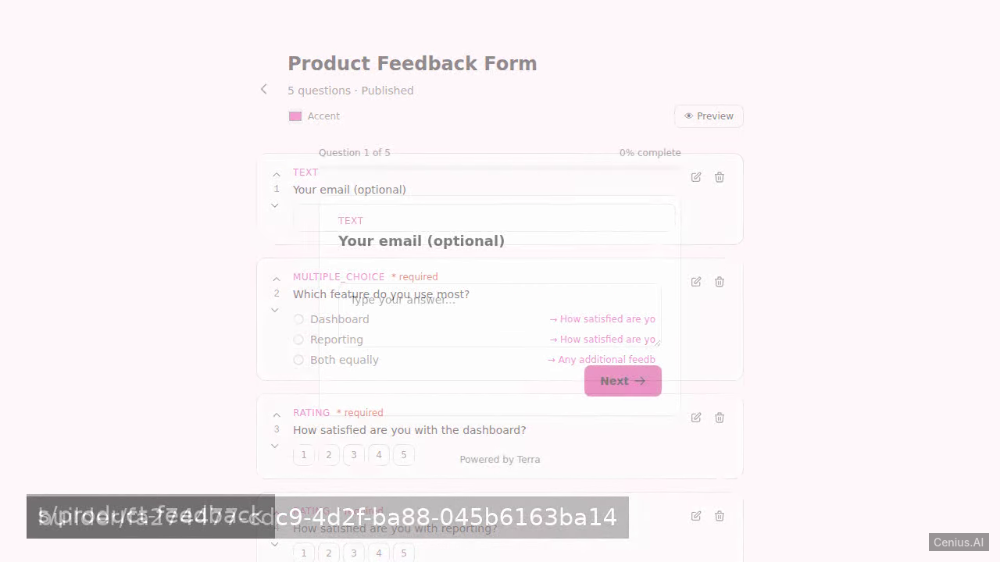
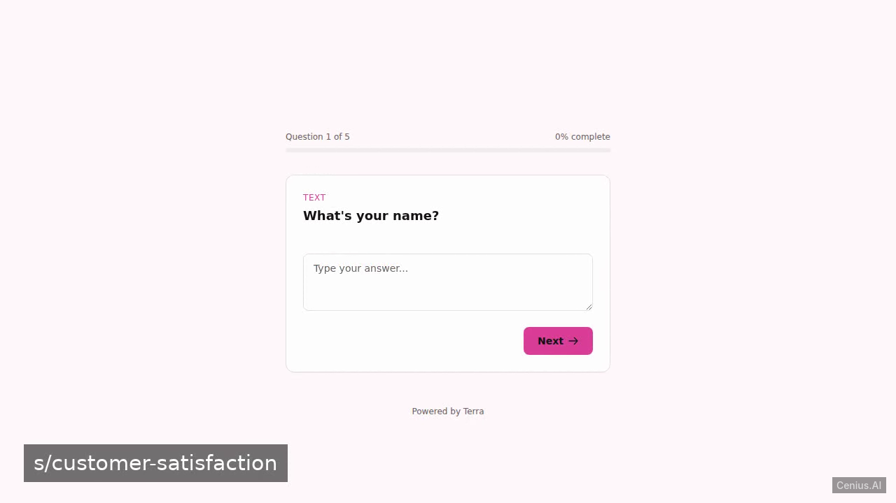
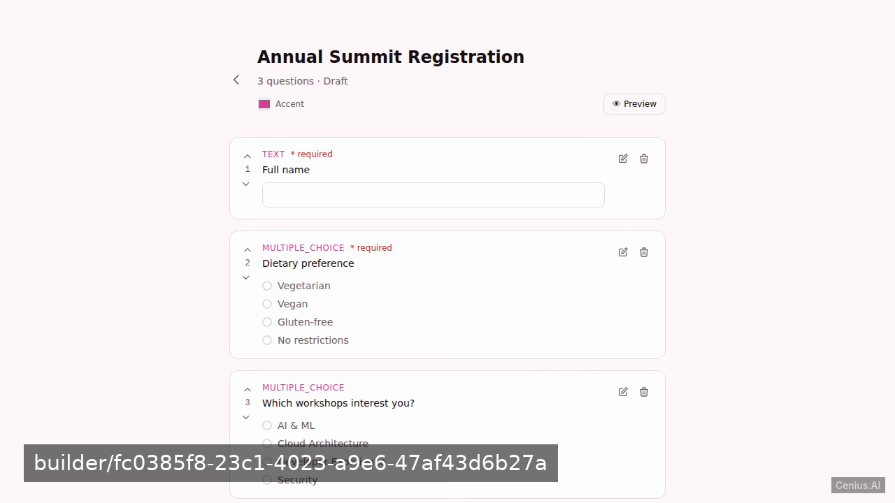

# Terra - Survey Builder — Elixir/Phoenix chat application reference implementation

**Terra - Survey Builder** is a free, open-source chat application built with Elixir/Phoenix. We will build a customer feedback survey and form builder, codenamed Terra, using Elixir Phoenix LiveView. Run it locally, deploy it as a self-hosted chat application, or [remix it on cenius.ai](https://cenius.ai/marketplace/p/terra---survey-builder?ref=gh&utm_campaign=terra-survey-builder-phoenix) to make it your own — the whole application (code, design, seeded demo data) ships in this repository under the Apache-2.0 license.

[](LICENSE)  [](https://cenius.ai)

[](https://cenius.ai/marketplace/p/terra---survey-builder?ref=gh&utm_campaign=terra-survey-builder-phoenix)

> **▶ [Open & edit in cenius.ai](https://cenius.ai/marketplace/p/terra---survey-builder?ref=gh&utm_campaign=terra-survey-builder-phoenix)** — one click to an editable workspace: describe changes in plain English, get an instant preview, one-click deploy and host. Modifications made on the platform come with full rebrand & relicense rights.

_Local clone? See [Quick start](#quick-start) below. cenius.ai is the zero-setup path._

## Demo




▶ **[Watch the full demo video](https://cenius.ai/marketplace/p/terra---survey-builder?ref=gh&utm_campaign=terra-survey-builder-phoenix)** — the complete walkthrough, playing on the project's cenius.ai page · [MP4 file](.github/media/demo.mp4)

## Screenshots

  

## Features

- Survey Creation & Editing
- Logic Branching
- Survey Taking
- Response Viewing
- Theme Customization
- Seeded Demo Data

## Quick start

```bash
./install.sh   # installs dependencies + seeds demo data
```

See [`INSTALL.md`](INSTALL.md) for full setup and usage instructions.

## Usage guide

### Starting the Application

After installation, start the server:

```bash
mix phx.server
```

Open [http://localhost:4000](http://localhost:4000) in your browser.

### Web Interface

#### Authentication
- Click **Sign up** to create a new user account (email + password).
- Log in with existing credentials.
- User authentication logic lives in `lib/terra_web/user_auth.ex` and `lib/terra_web/live/user_login_live.ex`.

#### Survey List (`SurveyListLive`)
- The home page after login shows a list of your surveys (loaded from `lib/terra/surveys.ex`).
- Create a new survey with the **New Survey** button.
- Click a survey title to edit it, or use the controls to delete it.

#### Building a Survey (`SurveyBuilderLive`)
- Add questions: click **Add Question**, choose type (text, multiple‑choice, etc.).
- Add options for multiple‑choice questions.
- Define **logic branching**: for each option you can specify a follow‑up question to jump to (conditional paths).
- The builder is implemented in `lib/terra_web/live/survey_builder_live.ex`.

#### Taking a Survey (`SurveyTakeLive`)
- Share the survey URL (e.g., `/surveys/:id/take`).
- Respondents answer questions one by one, following the branching logic.
- The flow is handled by `lib/terra_web/live/survey_take_live.ex`.

#### Viewing Results (`SurveyResultsLive`)
- After responses are collected, click **Results** on a survey to see aggregated data.
- Charts and statistics for each question (driven by `lib/terra_web/live/survey_results_live.ex`).

_Full guide: [`USAGE.md`](USAGE.md)_

## Architecture

Elixir/Phoenix application, delivered as a complete, runnable project (111 files). Top-level layout: `assets/`, `config/`, `cowlib-2.18.0/`, `lib/`, `priv/`. `install.sh` provisions dependencies and seeds demo data, so the app boots with something to show. Setup details live in [`INSTALL.md`](INSTALL.md).

## FAQ

### How do I self-host Terra - Survey Builder?

Clone this repository and run `./install.sh`, then start the app as described in [`INSTALL.md`](INSTALL.md). Terra - Survey Builder is fully self-hostable — no external services are required to try it.

### How can I customize Terra - Survey Builder without editing code?

Describe what you want changed on [cenius.ai](https://cenius.ai/marketplace/p/terra---survey-builder?ref=gh&utm_campaign=terra-survey-builder-phoenix) — no code editing needed; the platform produces a fresh build you can download and deploy.

### What powers Terra - Survey Builder under the hood?

The app is built with Elixir/Phoenix. What you see in this repo is the full production source, demo data included. Highlights include survey Creation & Editing.

### Does the Terra - Survey Builder license allow commercial use?

Yes. The code is Apache-2.0-licensed — use it, modify it, and ship it commercially. See [LICENSE](LICENSE).

### Is white-labeling Terra - Survey Builder allowed?

Absolutely. [Open it on cenius.ai](https://cenius.ai/marketplace/p/terra---survey-builder?ref=gh&utm_campaign=terra-survey-builder-phoenix) and remix it there — platform modifications come with full rebrand and relicense rights over your derivative, so the result is entirely yours.

## License & rebranding

Released under the [Apache License 2.0](LICENSE) (© 2026 Cenius AI) — free for personal and commercial use. The Cenius name/logo are trademarks (see NOTICE).

**Need a customized version?** [Remix this app on cenius.ai](https://cenius.ai/marketplace/p/terra---survey-builder?ref=gh&utm_campaign=terra-survey-builder-phoenix) — modifications made on the platform come with **full rebrand & relicense rights** over your derivative.

## Built with cenius.ai

This entire application — code, design, seeded demo data — was generated on **[cenius.ai](https://cenius.ai)** from a plain-English description.

- 🚀 [Build your own app on cenius.ai](https://cenius.ai)
- 🎛️ [Remix Terra - Survey Builder on the marketplace](https://cenius.ai/marketplace/p/terra---survey-builder?ref=gh&utm_campaign=terra-survey-builder-phoenix) — open it in a workspace, prompt for changes, and ship your own version.

More open-source apps: [the Cenius-ai catalog](https://github.com/Cenius-ai) · [showcase index](https://github.com/Cenius-ai/showcase)
